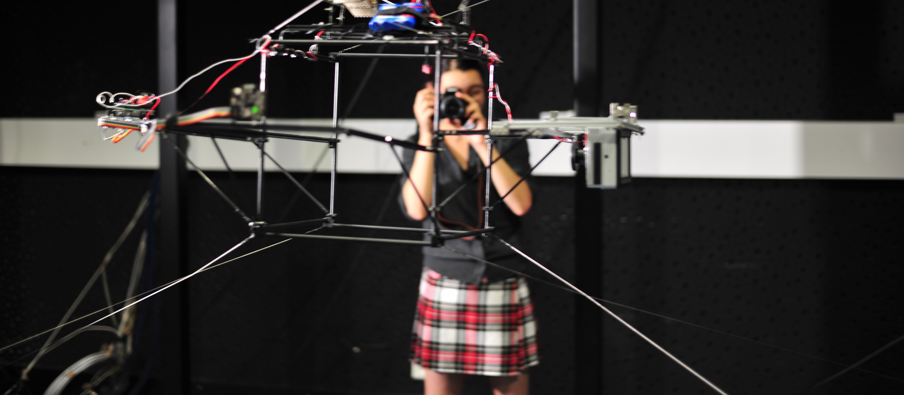

I am currently a Post-Doctoral fellow at SIRRL in University of Waterloo under the supervision of Professor Kerstin Dautenhahn. I got my PhD in Computer Science from the Université de Lorraine, Nancy, France.

I am interested in Robotics and AI. My work focuses mainly on Human-Robot Interactions in Healthcare (Robot-Assisted Therapy, Assistive robotics)
